# General guidelines

- The whole project has to be done in a virtual machine.
- You have to put all the configuration files of your project in folders located at the root of your repository (go to Submission and peer-evaluation for more information). The folders of the mandatory part will be named: `p1`, `p2` and `p3`, and the bonus one: `bonus`.
- This topic requires you to apply concepts that, depending on your background, you may not have covered yet. We therefore advise you not to be afraid to read a lot of documentation to learn how to use K8s with K3s, as well as K3d.

> You can use any tools you want to set up your host virtual machine as well as the provider used in Vagrant.

# Mandatory part

This project will consist of setting up several environments under specific rules.

It is divided into three parts you have to do in the following order:

- Part 1: K3s and Vagrant
- Part 2: K3s and three simple applications
- Part 3: K3d and Argo CD

## Part 1: K3s and Vagrant

To begin, you have to set up 2 machines.

Write your first `Vagrantfile` using the latest stable version of the distribution of your choice as your operating system. It is **STRONGLY** advised to allow only the bare minimum in terms of resources: 1 CPU and 512 MB of RAM (or 1024). The machines must be run using Vagrant.

Here are the expected specifications:

- The machine names must be the login of someone from your team. The hostname of the first machine must be followed by the capital letter `S` (like Server). The hostname of the second machine must be followed by `SW` (like ServerWorker).
- Have a dedicated IP on the primary network interface. The IP of the first machine (Server) will be `192.168.56.110`, and the IP of the second machine (ServerWorker) will be `192.168.56.111`.
- Be able to connect with SSH on both machines with no password.

> You will set up your `Vagrantfile` according to modern practices.

You must install K3s on both machines:

- In the first one (Server), it will be installed in controller mode.
- In the second one (ServerWorker), in agent mode.

You will have to use `kubectl` (and therefore install it as well).

Here is a basic example of a `Vagrantfile`:

```ruby
Vagrant.configure(2) do |config|
  [...]
  config.vm.box = REDACTED
  config.vm.box_url = REDACTED

  config.vm.define "wilS" do |control|
    control.vm.hostname = "wilS"
    control.vm.network REDACTED, ip: "192.168.56.110"
    control.vm.provider REDACTED do |v|
      v.customize ["modifyvm", :id, "--name", "wilS"]
      [...]
    end
    config.vm.provision :shell, :inline => SHELL
      [...]
    SHELL
    control.vm.provision "shell", path: REDACTED
  end

  config.vm.define "wilSW" do |control|
    control.vm.hostname = "wilSW"
    control.vm.network REDACTED, ip: "192.168.56.111"
    control.vm.provider REDACTED do |v|
      v.customize ["modifyvm", :id, "--name", "wilSW"]
      [...]
    end
    config.vm.provision "shell", inline: <<-SHELL
      [..]
    SHELL
    control.vm.provision "shell", path: REDACTED
  end
end
```

Here is an example when the virtual machines are launched:

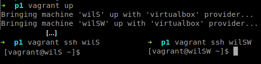

**Description:** `vagrant up` starts the `wilS` and `wilSW` machines with the VirtualBox provider. Separate `vagrant ssh wilS` and `vagrant ssh wilSW` commands then open passwordless shell sessions on both machines.

Here is an example when the configuration is not complete:

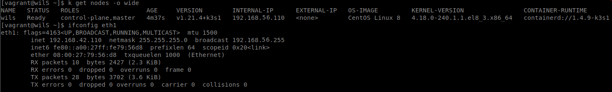

**Description:** `kubectl get nodes -o wide` shows only the `wils` controller node as Ready, with internal IP `192.168.56.110`. The accompanying `ifconfig eth1` output reports `192.168.42.110`.

Here is an example when the machines are correctly configured:

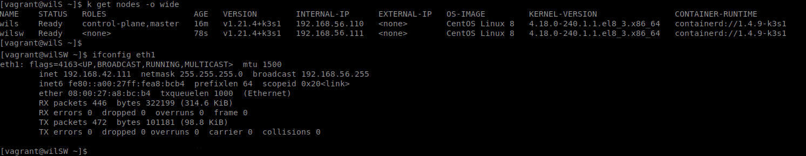

**Description:** `kubectl get nodes -o wide` shows the `wils` controller and `wilsw` worker as Ready, with internal IPs `192.168.56.110` and `192.168.56.111`. The worker's `ifconfig eth1` output is also displayed.

> The screenshots above are examples only. Modern Linux distributions use predictable network interface names (e.g., `enp0s8`, `enp0s9`) instead of `eth0`/`eth1`. To check your network configuration, use `ip a` to list all interfaces, or `ip a show <interface_name>` for a specific interface. On macOS, use `ifconfig`. Adapt the commands according to your system’s actual interface names.

## Part 2: K3s and three simple applications

You now understand the basics of K3s. Time to go further! To complete this part, you will need only one virtual machine with the distribution of your choice (latest stable version) and K3s in server mode installed.

You will set up 3 web applications of your choice that will run in your K3s instance. You will have to be able to access them depending on the `HOST` used when making a request to the IP address `192.168.56.110`. The name of this machine will be your login followed by `S` (e.g., `wilS` if your login is `wil`).

Here is a simple example diagram:

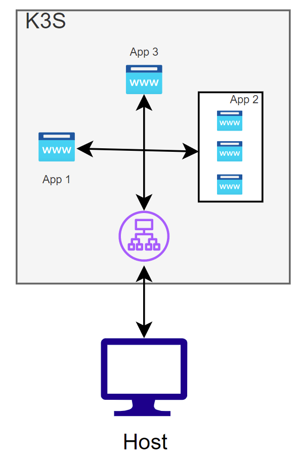

**Description:** Requests from the host enter K3s through an ingress or routing component. Host-based rules direct requests to App 1, App 2, or App 3. App 1 and App 3 each have one instance, while App 2 has three replicas.

When a client inputs the IP address `192.168.56.110` in their web browser with the `HOST` `app1.com`, the server must display app1. When the `HOST` `app2.com` is used, the server must display app2. Otherwise, app3 will be selected by default.

As you can see, application number 2 has 3 replicas. Adapt your configuration to create the replicas.

First, here is an expected result when the virtual machine is not configured:

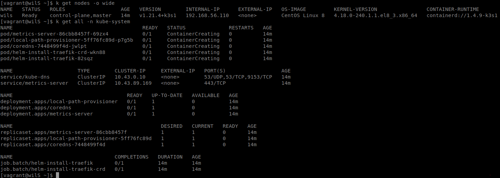

**Description:** The controller is Ready, but `kubectl get all -n kube-system` shows system pods in `ContainerCreating`, deployments with zero available replicas, and Traefik installation jobs with zero completions.

Here is an expected result when the virtual machine is correctly configured:

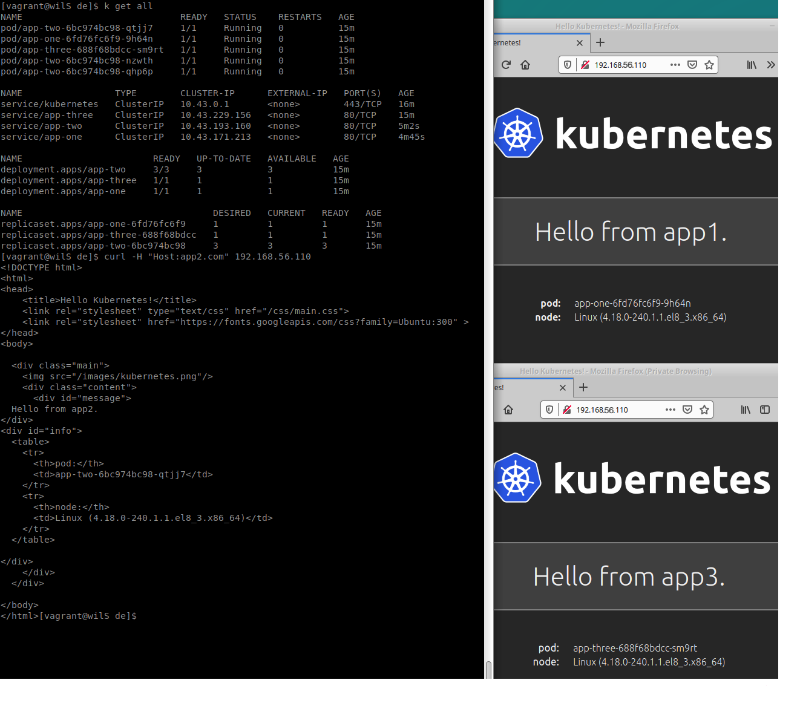

**Description:** `kubectl get all` shows App 1 and App 3 with one pod each and App 2 with three pods. Their services and deployments are available. A `curl` request with `Host: app2.com` returns “Hello from app2,” while browser examples display “Hello from app1” and the default “Hello from app3” response.

> The Ingress is not displayed here on purpose. You will have to show it to your evaluators during your defense.

## Part 3: K3d and Argo CD

You now master a minimalist version of K3s! Time to set up everything you have just learnt (and much more!) but without Vagrant this time. To begin, install K3d on your virtual machine.

> You will need Docker for K3d to work, and probably some other software as well. Therefore, you must write a script to install all the necessary packages and tools during your defense.

First of all, you must understand the difference between K3s and K3d.

Once your configuration works as expected, you can start to create your first continuous integration! To do so, you have to set up a small infrastructure following the logic illustrated by the diagram below:

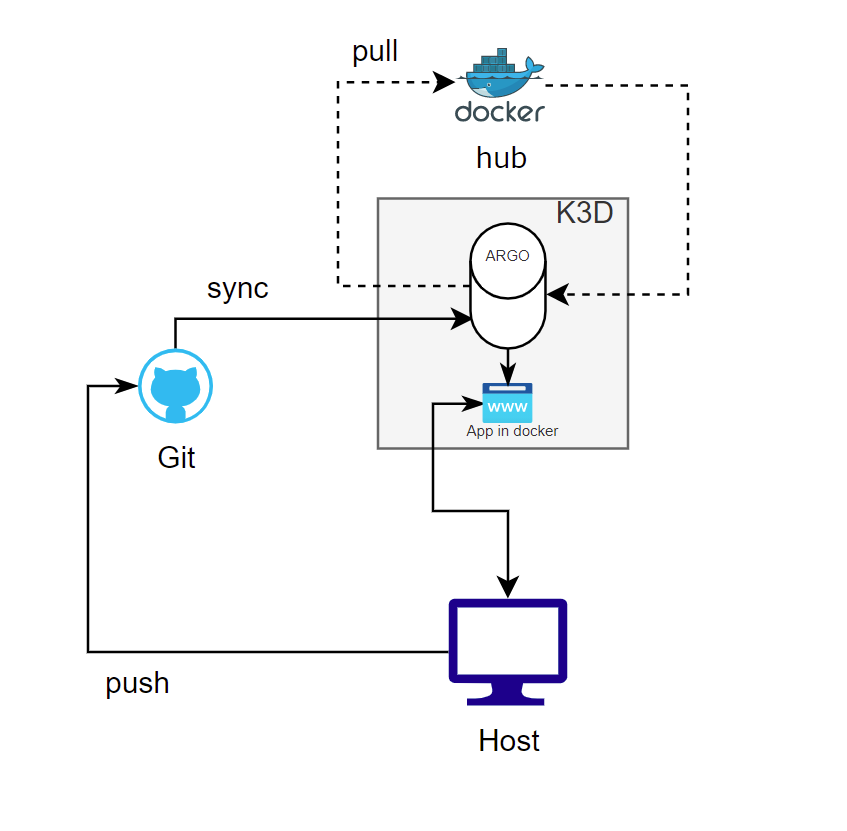

**Description:** The host pushes deployment configuration to GitHub. Argo CD synchronizes that Git repository into the K3d cluster. K3d pulls the application image from Docker Hub, and the host accesses the deployed application.

You have to create two namespaces:

- The first one will be dedicated to Argo CD.
- The second one will be named `dev` and will contain an application. This application will be automatically deployed by Argo CD using your online GitHub repository.

> Yes, indeed. You will have to create a public repository on GitHub where you will push your configuration files. You are free to organize it the way you like. The only mandatory requirement is to put the login of a member of the group in the name of your repository.

The application to be deployed must have two different versions (read about tagging if you are unfamiliar with it).

You have two options:

- You can use the pre-made application created by Wil, which is available on Docker Hub.
- Or you can code and use your own application. Create a public Docker Hub repository to push a Docker image of your application. Also, tag its two versions this way: `v1` and `v2`.

> You can find Wil’s application on Docker Hub here: <https://hub.docker.com/r/wil42/playground>. The application uses port `8888`. Find the two versions in the TAG section.

> If you decide to create your own application, it must be made available thanks to a public Docker image pushed into a Docker Hub repository. The two versions of your application must also have a few differences.

You must be able to change the version from your public GitHub repository, then check that the application has been correctly updated.

Here is an example showing the two namespaces and the POD located in the `dev` namespace:

```console
$ k get ns
NAME      STATUS   AGE
[..]
argocd    Active   19h
dev       Active   19h

$ k get pods -n dev
NAME                                  READY   STATUS    RESTARTS   AGE
wil-playground-65f745fdf4-d2l2r       1/1     Running   0          8m9s
```

Here is an example of launching Argo CD that was configured:

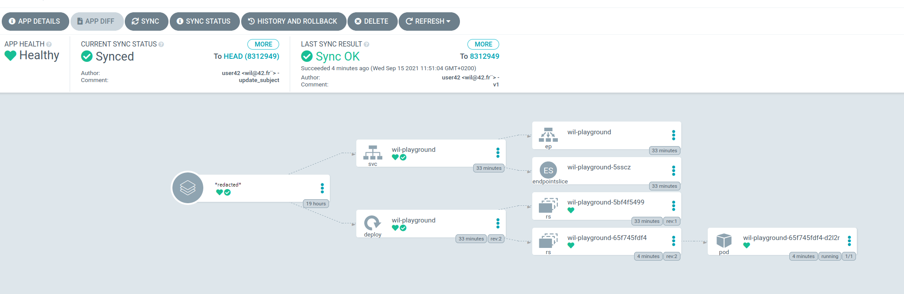

**Description:** The Argo CD application is Healthy and Synced to Git revision `8312949`. Its resource graph contains the `wil-playground` service, deployment, endpoint, endpoint slice, replica sets, and one running pod.

We can check that our application uses the version we expect (in this case, v1):

```console
$ cat deployment.yaml | grep v1
- image: wil42/playground:v1
$ curl http://localhost:8888/
{"status":"ok", "message": "v1"}
```

Here is a screenshot of Argo CD with our v1 application using GitHub:

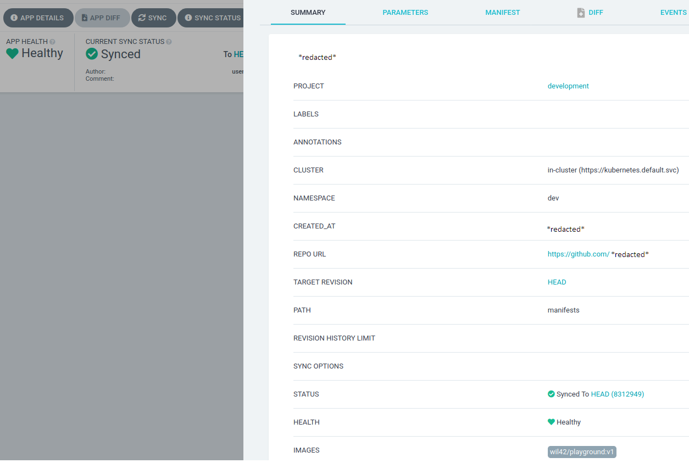

**Description:** The application targets the in-cluster Kubernetes API, the `dev` namespace, Git revision `HEAD`, and the `manifests` repository path. It is Healthy and Synced and currently uses `wil42/playground:v1`.

Below, we update our GitHub repository by changing the version of our application:

```console
$ sed -i 's/wil42\/playground\:v1/wil42\/playground\:v2/g' deployment.yaml
$ g up "v2" # git add+commit+push
[..]
a773f39..999b9fe master -> master
$ cat deployment.yaml | grep v2
- image: wil42/playground:v2
```

You can see thanks to Argo CD that the application is synchronized:

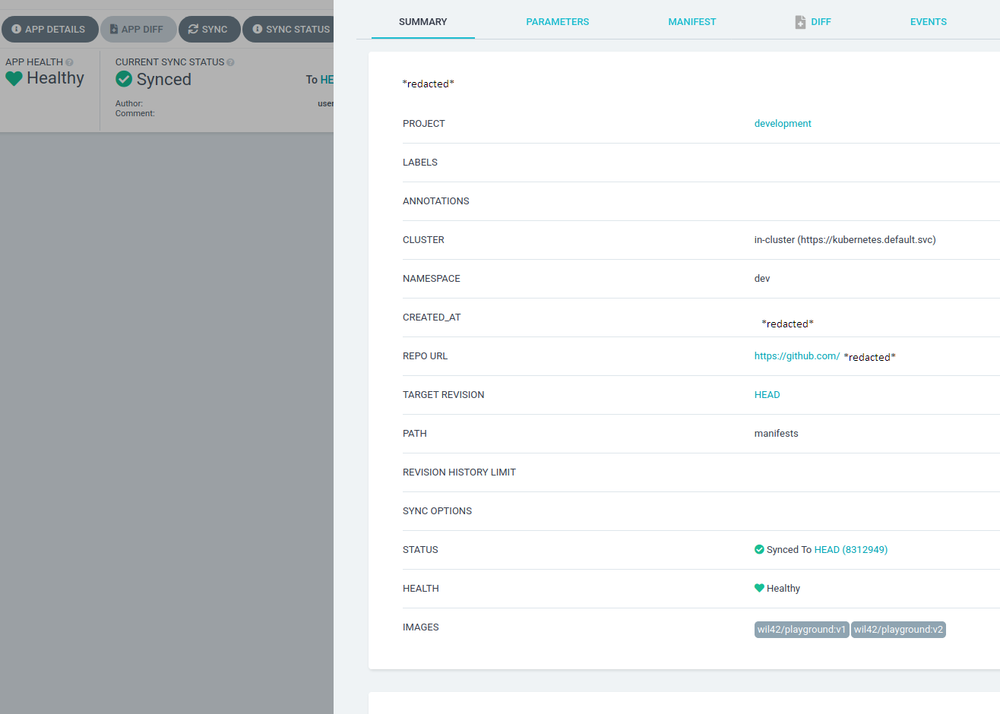

**Description:** The application remains Healthy and Synced while Argo CD reports both `wil42/playground:v1` and `wil42/playground:v2`, indicating the deployment is transitioning between versions.

The application was successfully updated:

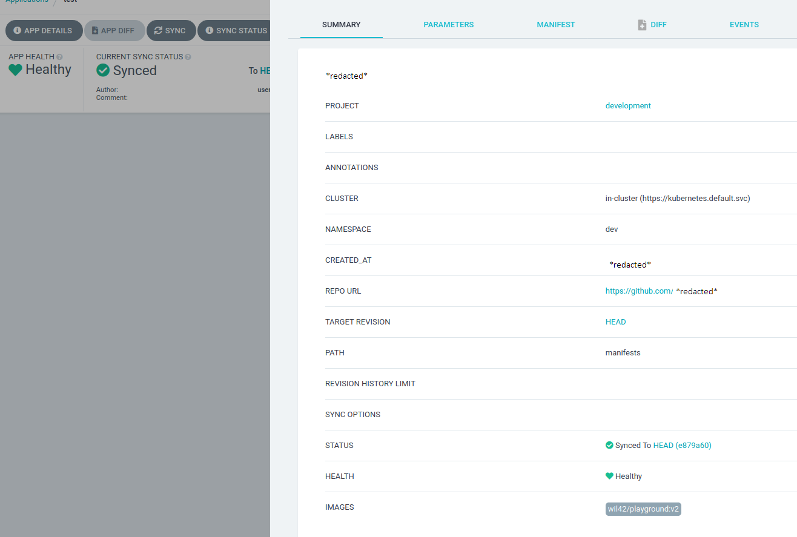

**Description:** The application is Healthy and Synced to revision `e879a60`. The image list now contains only `wil42/playground:v2`, confirming that the update completed.

We check that the new version is available:

```console
$ curl http://localhost:8888/
{"status":"ok", "message": "v2"}
```

> During the evaluation process, you will have to do this operation with the app you chose: Wil’s or yours.

# Bonus part

The following bonus task is intended to be useful: add Gitlab to the lab you completed in Part 3.

> Beware this bonus is complex. The latest version available of Gitlab from the official website is expected.

You are allowed to use whatever you need to achieve this extra. For example, Helm could be useful here.

- Your Gitlab instance must run locally.
- Configure Gitlab to make it work with your cluster.
- Create a dedicated namespace named `gitlab`.
- Everything you did in Part 3 must work with your local Gitlab.

Turn this extra work in a new folder named `bonus` and located at the root of your repository. You can add everything needed so your entire cluster works.

> The bonus part will only be assessed if the mandatory part is flawless. Flawless means the mandatory part has been fully completed and functions without issues. If you have not passed **ALL** the mandatory requirements, your bonus part will not be evaluated at all.

# Submission and peer-evaluation

Turn in your assignment in your Git repository as usual. Only the work inside your repository will be evaluated during the defense. Don’t hesitate to double-check the names of your folders and files to ensure they are correct.

Reminder:

- Turn the mandatory part in three folders located at the root of your repository: `p1`, `p2` and `p3`.
- Optional: Turn the bonus part in a folder located at the root of your repository: `bonus`.

Below is an example of the expected directory structure:

```text
.
├── p1
│   ├── Vagrantfile
│   ├── scripts
│   └── confs
├── p2
│   ├── Vagrantfile
│   ├── scripts
│   └── confs
├── p3
│   ├── scripts
│   └── confs
└── bonus
    ├── Vagrantfile
    ├── scripts
    └── confs
```

Any scripts you need will be added in a `scripts` folder. The configuration files will be in a `confs` folder.

> The evaluation process will happen on the computer of the evaluated group.

---

# Evaluation guide

## Introduction

Please comply with the following rules:

- Remain polite, courteous, respectful and constructive throughout the evaluation process. The well-being of the community depends on it.
- Identify with the student or group whose work is evaluated the possible dysfunctions in their project. Take the time to discuss and debate the problems that may have been identified.
- You must consider that there might be some differences in how your peers might have understood the project's instructions and the scope of its functionalities. Always keep an open mind and grade them as honestly as possible. The pedagogy is useful only and only if the peer-evaluation is done seriously.

## Guidelines

- Only grade the work that was turned in the Git repository of the evaluated student or group.
- Double-check that the Git repository belongs to the student(s). Ensure that the project is the one expected. Also, check that `git clone` is used in an empty folder.
- Check carefully that no malicious aliases were used to fool you and make you evaluate something that is not the content of the official repository.
- To avoid any surprises and if applicable, review together any scripts used to facilitate the grading (scripts for testing or automation).
- If you have not completed the assignment you are going to evaluate, you have to read the entire subject prior to starting the evaluation process.
- Use the available flags to report an empty repository, a non-functioning program, a Norm error, cheating, and so forth. In these cases, the evaluation process ends and the final grade is 0, or -42 in case of cheating. However, except for cheating, students are strongly encouraged to review together the work that was turned in, in order to identify any mistakes that shouldn't be repeated in the future.

## Preliminaries

If cheating is suspected, the evaluation stops here. Use the "Cheat" flag to report it. Take this decision calmly, wisely, and please use this button with caution.

### Preliminary tests

- Defense can only happen if the evaluated group is present. This way everybody learns by sharing knowledge with each other.
- If no work has been submitted (or wrong files, or wrong directory, or wrong filenames), the grade is 0, and the evaluation process ends.
- For this project, you have to clone the Git repository on the group's machine.
- For this project, you must use the virtual machine of 42.

## General instructions

- During the defense, whenever you need help in order to verify a requirement of the subject, the evaluated group must help you.
- Ensure that all the files required for the three different parts of the project are in the folders `p1`, `p2` and `p3` respectively. There may be an additional `bonus` folder.

## Mandatory part

The project consists of setting up several infrastructures with different services that use K3s, Vagrant and K3d. Make sure that all of the following requirements are met.

### Global configuration and explanation

Those being evaluated should explain to you in a simple way:

- The basic operation of K3s.
- The basic operation of Vagrant.
- The basic operation of K3d.
- What continuous integration and Argo CD are.

### Part 1 — Configuration

- Check that a `Vagrantfile` is present in the `p1` folder. Once done, check its content. Thanks to the help of the evaluated persons, you should basically understand this file. It must be similar to the example given in the subject.
- Check that there are two virtual machines in the `Vagrantfile`.
- In the `Vagrantfile`, check that the latest stable version of CentOS is used for both virtual machines.
- Check that there is an `eth1` interface with the IP addresses required by the subject.
- The names chosen for the two virtual machines must include a login of a member of the group. For the first machine, it must be followed by `S` (like Server), and for the second one, by `SW` (like ServerWorker).

If something does not work as expected, the evaluation stops here.

### Part 1 — Usage

- Use Vagrant to SSH into both virtual machines with the help of the evaluated group.
- Ensure there is an `eth1` interface with the IP addresses required by the subject by using the command `ifconfig eth1`.
- Ensure both machines have the hostname required by the subject.
- Then, check that both virtual machines use K3s. The evaluated group should be able to help you.
- Finally, verify that the Server machine and the Agent machine are in the same cluster by running `kubectl get nodes -o wide` on the Server machine.

An output similar to the one given as an example in the subject is expected. The evaluated group must explain to you the output.

If something does not work as expected, the evaluation stops here.

### Part 2 — Configuration

- To avoid space/performance issues, you can of course shut down every other running virtual machine with the help of the evaluated group.
- Check that a `Vagrantfile` is present in the `p2` folder. Once done, check its content. Thanks to the help of the evaluated persons, you should basically understand this file. It must be similar to the example given in Part 1 of the subject.
- Check that there is only one virtual machine in the `Vagrantfile`.
- In the `Vagrantfile`, check that the latest stable version of CentOS is used for the virtual machine.
- Check that there is an `eth1` interface with the IP address required by the subject.
- The name chosen for the virtual machine must include a login of a member of the group followed by the capital letter `S`.
- If extra files are present in the `p2` folder, verify them and ask for explanations.

If something does not work as expected, the evaluation stops here.

### Part 2 — Usage

- Use Vagrant to SSH into the virtual machine with the help of the evaluated group.
- Ensure there is an `eth1` interface with the IP address required by the subject by using `ifconfig eth1`.
- Ensure the machine has the hostname required by the subject.
- Then, check that the virtual machine uses K3s. The evaluated group should be able to help you.
- Verify that the virtual machine meets the subject's requirements. To do so, use the following commands:
  - `kubectl get nodes -o wide` should display the name of the controller and the internal IP address.
  - `kubetctl get all -n kube-system` should display 3 applications. The second one must have 3 replicas.
- The evaluated group must explain to you each output.
- Next, they must show you how their Ingress works. The command is deliberately not given here.
- Now, check that the 3 applications can be accessed depending on the `HOST` header that is used (have a look at the subject). To do so, you can use `curl` with the help of the evaluated group, or just a browser (for a web application). You will have to change the `HOST` in order to see some differences.

If something does not work as expected, the evaluation stops here.

### Part 3 — Configuration

- Thanks to the evaluated group, start up the infrastructure.
- Check that the configuration files are present in the `p3` folder. Once done, check their content. Don't hesitate to ask for more precise explanations. This part is essential to understand what's next.
- Make sure there are at least 2 namespaces in K3d: `argocd` and `dev`. Use `kubectl get ns`.
- Verify that there is at least 1 pod in the `dev` namespace. Use `kubectl get pods -n dev`.
- Ensure the group members understand the differences between a namespace and a pod.
- Check that all the required services are running with the help of the evaluated group.
- Check that Argo CD is installed and configured. You can access it in your web browser. You will need a login and a password. The evaluated group will give them to you.
- Check that the login of someone in the group was put in the name of the GitHub repository (e.g., if a login was `wil`, the name could be `wil_config` or `wil-ception`). Read the subject carefully to understand this part.
- Check that a Docker image is used in the GitHub repository. The image can be Wil's or a custom one. In the second case, verify that the login of a member of the group was put in the name of the Docker Hub repository. Also, ensure that there are the two required tags in the Docker Hub repository.
- If there are extra files in the `p3` folder, ask for explanations.

If something does not work as expected, the evaluation stops here.

### Part 3 — Usage

- Now that you can use Argo CD, try to understand how it basically works. With the help of the evaluated group, navigate through the application. Do not hesitate to ask questions here. If you have any doubt (maybe their explanations are confused or they can't explain something they should know), the evaluation stops now. It is important.
- Check that the v1 application can be accessed from this machine. You can use `curl` (there is an example usage in the subject).
- Verify that Docker Hub is used. This part is important. In case of any doubt, the evaluation stops now.
- Since you can see the v1 application, you must be able to update it with the help of the evaluated group. Use the configuration file on GitHub that Argo CD relies on. You must commit and push a modification. It will automatically trigger the update of your application. You must be able to understand how this whole process works. Do not hesitate to ask for explanations.
- Now that you have pushed the v2 application on GitHub, if synchronizing didn't happen, do it manually in Argo CD (if it did happen, skip this step). The evaluated people must help you.
- Ensure that the application was successfully synchronized using the operation given as an example in the subject. The evaluated people must help you.

If something does not work as expected, the evaluation stops now.

## Bonus evaluation

Evaluate the bonus part if, and only if, the mandatory part has been entirely and perfectly done, and the error management handles unexpected or wrong usage. In case all the mandatory points were not passed during the defense, bonus points must be totally ignored.

- Check if there are configuration files in the `bonus` folder. Ask for explanations about each of them.
- Test Gitlab functions correctly and was properly implemented. To do so, create a new repository with the help of the evaluated group. Then, try to add some code in it. Check the operation was successful on Gitlab.
- The last step is quite simple. Make sure that the operations of Part 3 of the subject still function correctly. Ensure that the repository used in Argo CD is a local repository on Gitlab. The evaluated group should guide you in this process so you can verify the operations work as expected with the two versions of the chosen application.
- If the synchronization and the version change of the application are completed with no errors, validate this part.

## Ratings

Don't forget to check the flag corresponding to the defense:

- OK
- Empty work
- Incomplete work
- Cheat
- Outstanding project
- Crash
- Concerning situation
- Incomplete group
- Forbidden function

## Conclusion

Leave a comment on this evaluation, then finish the evaluation.
